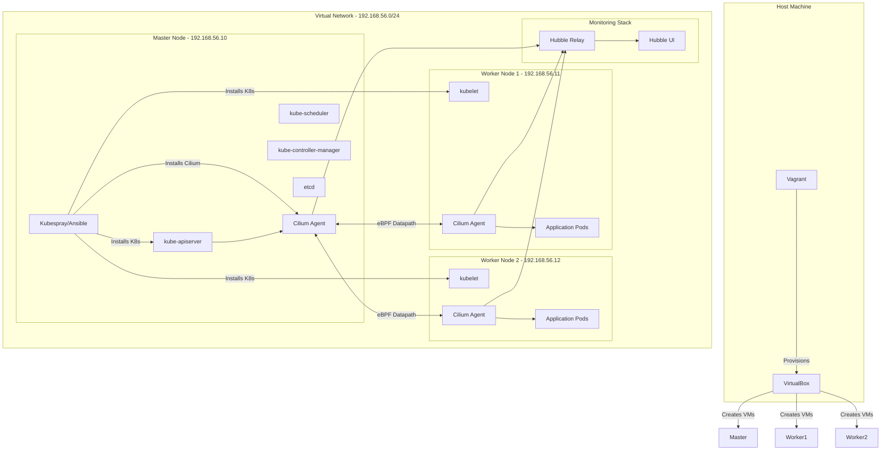
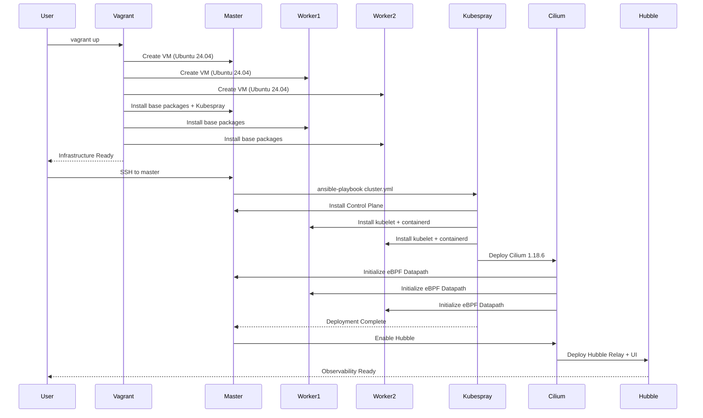

# Design Document: Cilium Kubernetes Cluster Setup

## Overview

이 문서는 Vagrant와 VirtualBox를 사용하여 Ubuntu 24.04 기반의 Kubernetes 1.35.1 클러스터를 구축하고, Cilium 1.18.6을 CNI 플러그인으로 설정하는 시스템 설계를 다룹니다. 클러스터는 1개의 Master 노드와 2개의 Worker 노드로 구성되며, Kubespray를 Master 노드에서 직접 실행하여 전체 클러스터를 자동 배포합니다.

이 설계의 핵심 특징은 Master 노드가 Ansible 컨트롤러 역할을 겸하여 자기 자신과 Worker 노드들을 프로비저닝한다는 점입니다. 이는 외부 의존성을 최소화하고 클러스터 내부에서 완전한 자동화를 가능하게 합니다.

## Architecture

### Overall System Architecture



### Deployment Sequence



## Components and Interfaces

### Component 1: Infrastructure Layer (Vagrant + VirtualBox)

**Purpose**: VM 프로비저닝 및 기본 환경 구성

**Interface**:
```ruby
# Vagrantfile API
Vagrant.configure("2") do |config|
  config.vm.box = "alvistack/ubuntu-24.04"
  config.vm.box_version = "20260108.1.1"
  config.vm.network "private_network", ip: String
  config.vm.provider "virtualbox" do |vb|
    vb.memory = Integer
    vb.cpus = Integer
  end
  config.vm.provision "shell", path: String
end
```

**Responsibilities**:
- Ubuntu 24.04 VM 생성 및 리소스 할당
- 네트워크 인터페이스 구성 (192.168.56.0/24)
- Master 노드에 Kubespray 설치 및 구성
- 모든 노드에 기본 패키지 설치 (Python3, pip, SSH)
- SSH 키 배포 및 passwordless 접근 설정

**Configuration Parameters**:
- Master Node: 192.168.56.10, 4GB RAM, 2 CPU
- Worker Node 1: 192.168.56.11, 3GB RAM, 2 CPU
- Worker Node 2: 192.168.56.12, 3GB RAM, 2 CPU

### Component 2: Kubespray Deployment Engine

**Purpose**: Master 노드에서 실행되어 전체 클러스터를 자동 배포

**Interface**:
```yaml
# Kubespray Inventory
all:
  hosts:
    master:
      ansible_host: 192.168.56.10
      ip: 192.168.56.10
      ansible_connection: local
    worker-1:
      ansible_host: 192.168.56.11
      ip: 192.168.56.11
    worker-2:
      ansible_host: 192.168.56.12
      ip: 192.168.56.12
  children:
    kube_control_plane:
      hosts: {master: null}
    kube_node:
      hosts: {worker-1: null, worker-2: null}
    etcd:
      hosts: {master: null}
```

**Responsibilities**:
- Kubernetes 1.35.1 바이너리 다운로드 및 설치
- containerd 컨테이너 런타임 구성
- etcd 클러스터 초기화 (단일 노드)
- Control Plane 컴포넌트 설치 (apiserver, scheduler, controller-manager)
- Worker 노드 kubelet 구성 및 클러스터 조인
- Cilium 1.18.6 CNI 플러그인 배포
- kubeconfig 파일 생성

**Key Configuration**:
- `kube_network_plugin: cilium`
- `kube_version: v1.35.1`
- `container_manager: containerd`
- `kube_pods_subnet: 10.244.0.0/16`
- `kube_service_addresses: 10.96.0.0/12`

### Component 3: Cilium CNI Plugin (v1.18.6)

**Purpose**: eBPF 기반 네트워킹, 보안, 관찰성 제공

**Interface**:
```yaml
# Cilium Configuration
apiVersion: cilium.io/v2
kind: CiliumConfig
spec:
  version: 1.18.6
  ipam:
    mode: kubernetes
  kubeProxyReplacement: true
  k8sServiceHost: 192.168.56.10
  k8sServicePort: 6443
  hubble:
    enabled: true
    relay:
      enabled: true
    ui:
      enabled: true
  bpf:
    masquerade: true
```

**Responsibilities**:
- Pod 네트워크 인터페이스 생성 및 IP 할당 (10.244.0.0/16)
- eBPF 프로그램을 통한 패킷 라우팅
- Service Load Balancing (kube-proxy 대체)
- Network Policy 적용 및 강제
- Hubble을 통한 네트워크 플로우 관찰

**New Features in 1.18.6**:
- 향상된 eBPF 성능 최적화
- 개선된 IPv6 지원
- 확장된 Hubble 메트릭
- 더 나은 멀티 클러스터 지원

### Component 4: Hubble Observability Platform

**Purpose**: 네트워크 플로우 관찰 및 모니터링

**Interface**:
```yaml
# Hubble Service
apiVersion: v1
kind: Service
metadata:
  name: hubble-ui
  namespace: kube-system
spec:
  type: NodePort
  ports:
    - port: 80
      targetPort: 8081
      nodePort: 31234
```

**Responsibilities**:
- 네트워크 플로우 데이터 수집
- Service Map 시각화
- Network Policy 적용 상태 모니터링
- DNS 및 HTTP 요청 추적

## Data Models

### VM Configuration Model

```yaml
VMConfig:
  name: string                    # VM 이름
  box: string                     # alvistack/ubuntu-24.04
  box_version: string             # 20260108.1.1
  ip: string                      # 192.168.56.x
  memory: integer                 # RAM (MB)
  cpus: integer                   # CPU 코어 수
  provision_script: string        # 프로비저닝 스크립트 경로
```

### Kubernetes Cluster Model

```yaml
K8sCluster:
  version: string                 # v1.35.1
  cluster_name: string            # cluster.local
  kube_network_plugin: string     # cilium
  kube_pods_subnet: string        # 10.244.0.0/16
  kube_service_addresses: string  # 10.96.0.0/12
  container_manager: string       # containerd
  kube_apiserver_ip: string       # 192.168.56.10
```

### Cilium Configuration Model

```yaml
CiliumConfig:
  version: string                 # 1.18.6
  ipam_mode: string              # kubernetes
  kube_proxy_replacement: boolean # true
  hubble:
    enabled: boolean             # true
    relay_enabled: boolean       # true
    ui_enabled: boolean          # true
```

## Algorithmic Pseudocode

### Main Deployment Algorithm

```pascal
ALGORITHM deployClusterFromMaster()
INPUT: None (executed on master node)
OUTPUT: result of type DeploymentResult

PRECONDITIONS:
  - Master node has Kubespray installed
  - SSH keys are distributed to all nodes
  - All nodes are running and accessible
  - Network 192.168.56.0/24 is configured

POSTCONDITIONS:
  - Kubernetes cluster is operational
  - All nodes are in Ready state
  - Cilium CNI is functioning
  - Hubble UI is accessible

BEGIN
  // Phase 1: Prepare Kubespray Inventory
  inventory ← generateInventory({
    master: "192.168.56.10",
    workers: ["192.168.56.11", "192.168.56.12"]
  })
  ASSERT inventoryValid(inventory) = true
  
  // Phase 2: Configure Cluster Parameters
  clusterConfig ← {
    kube_version: "v1.35.1",
    kube_network_plugin: "cilium",
    cilium_version: "1.18.6",
    container_manager: "containerd"
  }
  writeConfig(clusterConfig)
  
  // Phase 3: Execute Kubespray Playbook
  result ← executeAnsible("cluster.yml", inventory)
  ASSERT result.success = true
  
  // Phase 4: Verify Cluster Health
  ASSERT allNodesReady() = true
  ASSERT ciliumHealthy() = true
  
  // Phase 5: Enable Hubble
  enableHubble()
  ASSERT hubbleUIAccessible() = true
  
  RETURN DeploymentResult{
    success: true,
    cluster_endpoint: "https://192.168.56.10:6443"
  }
END
```

### Kubespray Execution Algorithm

```pascal
ALGORITHM executeKubespray(inventory, config)
INPUT: inventory of type InventoryFile, config of type ClusterConfig
OUTPUT: result of type ExecutionResult

PRECONDITIONS:
  - Ansible is installed on master node
  - Inventory file is valid
  - All target nodes are accessible via SSH

POSTCONDITIONS:
  - Kubernetes components are installed on all nodes
  - Cilium CNI is deployed
  - Cluster is operational

BEGIN
  // Step 1: Validate Prerequisites
  ASSERT ansibleInstalled() = true
  ASSERT allNodesReachable(inventory.hosts) = true
  
  // Step 2: Run Cluster Playbook
  cmd ← "ansible-playbook -i inventory/mycluster/hosts.yaml cluster.yml"
  process ← execute(cmd)
  
  // Step 3: Monitor Execution
  WHILE process.running DO
    output ← process.readLine()
    log(output)
    
    IF output.contains("FAILED") THEN
      RETURN ExecutionResult{success: false, error: output}
    END IF
  END WHILE
  
  // Step 4: Verify Installation
  ASSERT kubeConfigExists() = true
  ASSERT apiServerResponding() = true
  
  RETURN ExecutionResult{success: true}
END
```

## Key Functions with Formal Specifications

### Function 1: provisionVMs()

```pascal
FUNCTION provisionVMs(vmConfigs: List[VMConfig]): ProvisionResult
```

**Preconditions:**
- VirtualBox and Vagrant are installed
- Host machine has sufficient resources (10GB RAM, 50GB disk)
- Network 192.168.56.0/24 is available

**Postconditions:**
- All VMs are created and running
- Network connectivity is established
- SSH access is configured
- Master node has Kubespray installed

### Function 2: installKubesprayOnMaster()

```pascal
FUNCTION installKubesprayOnMaster(masterIP: String): InstallResult
```

**Preconditions:**
- Master VM is running
- Internet connectivity is available
- Python3 and pip are installed

**Postconditions:**
- Kubespray repository is cloned
- Python dependencies are installed
- Inventory template is created
- SSH keys are generated and distributed

### Function 3: deployCluster()

```pascal
FUNCTION deployCluster(): DeploymentResult
```

**Preconditions:**
- Kubespray is installed on master
- Inventory file is configured
- All nodes are accessible

**Postconditions:**
- Kubernetes 1.35.1 is installed
- Cilium 1.18.6 is deployed
- All nodes are joined to cluster
- kubeconfig is available

### Function 4: verifyCilium()

```pascal
FUNCTION verifyCilium(): VerificationResult
```

**Preconditions:**
- Cilium is deployed
- kubectl is configured

**Postconditions:**
- Cilium agents are running on all nodes
- eBPF programs are loaded
- Pod network is functional
- Hubble is accessible

## Example Usage

```bash
# Step 1: Provision VMs with Vagrant
vagrant up

# Step 2: SSH to master node
vagrant ssh master

# Step 3: Navigate to Kubespray directory
cd kubespray

# Step 4: Deploy cluster from master
ansible-playbook -i inventory/mycluster/hosts.yaml cluster.yml

# Step 5: Verify cluster
kubectl get nodes
kubectl get pods -A

# Step 6: Access Hubble UI
# Open browser: http://192.168.56.10:31234
```

## Error Handling

### Error Scenario 1: Insufficient Host Resources

**Condition**: Host machine has less than 10GB free RAM
**Response**: Vagrant provisioning fails with clear error message
**Recovery**: User must free up resources or reduce VM allocations

### Error Scenario 2: Network Conflict

**Condition**: Network 192.168.56.0/24 is already in use
**Response**: VirtualBox network creation fails
**Recovery**: User must change network configuration in Vagrantfile

### Error Scenario 3: Kubespray Playbook Failure

**Condition**: Ansible playbook encounters error during execution
**Response**: Playbook stops and logs error details
**Recovery**: User examines logs, fixes issue, and re-runs playbook

### Error Scenario 4: Cilium Installation Failure

**Condition**: Cilium pods fail to start
**Response**: Deployment reports unhealthy status
**Recovery**: Check Cilium logs, verify network configuration, re-deploy if needed

## Testing Strategy

### Unit Testing Approach

- Test VM provisioning scripts independently
- Test inventory generation logic
- Test configuration file validation
- Mock Ansible execution for testing

### Integration Testing Approach

- Test complete deployment flow from start to finish
- Verify inter-node communication
- Test pod-to-pod connectivity across nodes
- Verify Cilium network policies
- Test Hubble data collection

### Validation Tests

- All nodes reach Ready state within 10 minutes
- All system pods reach Running state
- Test pod can be created and receives IP
- DNS resolution works within cluster
- Hubble UI is accessible via NodePort

## Performance Considerations

- VM provisioning: ~5 minutes for all 3 VMs
- Kubespray deployment: ~15-20 minutes
- Cilium initialization: ~2-3 minutes
- Total deployment time: ~25-30 minutes

## Security Considerations

- SSH key-based authentication only (no passwords)
- Private network isolation (192.168.56.0/24)
- Kubernetes RBAC enabled by default
- Cilium Network Policies for pod-level security
- etcd data encryption at rest (optional)

## Dependencies

- Host Machine: VirtualBox 7.0+, Vagrant 2.3+
- Guest OS: Ubuntu 24.04 LTS
- Kubernetes: v1.35.1
- Cilium: v1.18.6
- Kubespray: Latest stable release supporting K8s 1.35.1
- Container Runtime: containerd 1.7+
- Python: 3.10+ (for Ansible)
- Ansible: 2.14+ (installed via Kubespray)

## Correctness Properties

1. **Cluster Completeness**: ∀ node ∈ {master, worker-1, worker-2}, nodeStatus(node) = "Ready"
2. **Network Connectivity**: ∀ pod1, pod2 ∈ cluster, canCommunicate(pod1, pod2) = true
3. **IP Allocation**: ∀ pod ∈ cluster, pod.ip ∈ 10.244.0.0/16
4. **Service Discovery**: ∀ service ∈ cluster, dnsResolves(service.name) = true
5. **Cilium Health**: ciliumStatus() = "OK" ∧ ∀ node ∈ cluster, ciliumAgentRunning(node) = true
6. **Hubble Accessibility**: httpGet("http://192.168.56.10:31234").status = 200
7. **Deployment Idempotency**: deploy() ∧ deploy() ≡ deploy()
