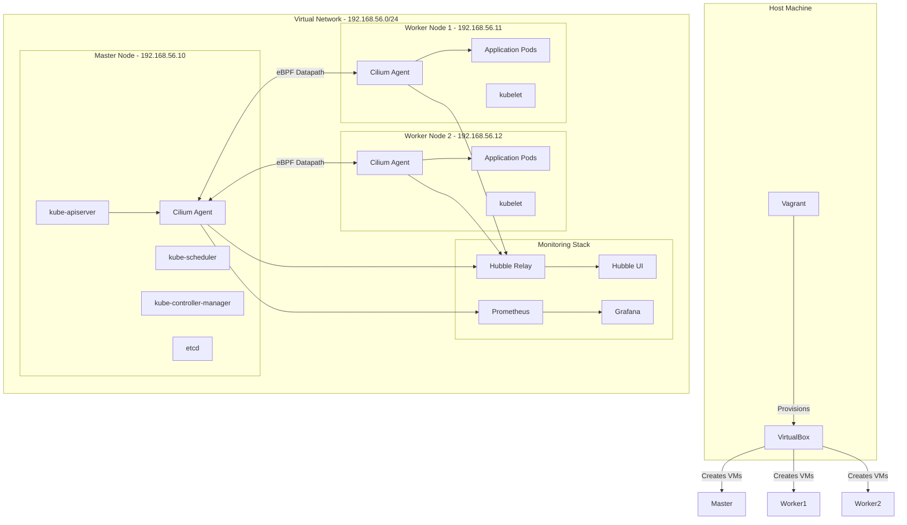
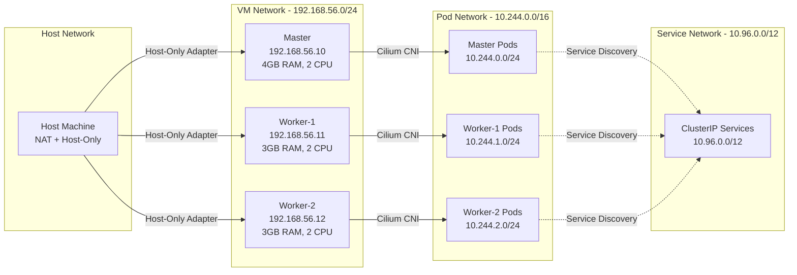
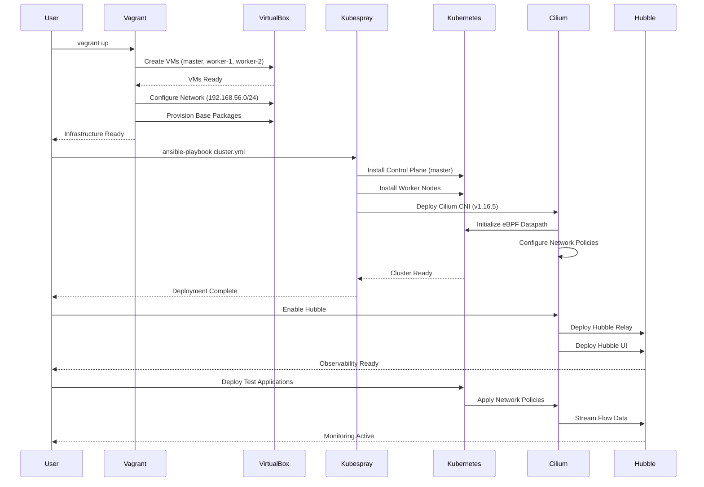

# Design Document: Cilium Kubernetes Cluster Setup

## Overview

이 문서는 VirtualBox와 Vagrant를 사용하여 로컬 환경에 Kubernetes 1.34.2 클러스터를 구축하고, Cilium v1.16.5를 네트워크 플러그인으로 설정하는 전체 시스템 설계를 다룹니다. 클러스터는 1개의 Master 노드와 2개의 Worker 노드로 구성되며, Kubespray를 통해 자동 배포됩니다. Cilium은 eBPF 기반의 고성능 네트워킹, 보안, 관찰성을 제공하며, Hubble UI를 통한 실시간 모니터링, Network Policy 기반 보안, L7 프로토콜 인식, WireGuard 암호화 등의 고급 기능을 지원합니다.

이 설계는 인프라 프로비저닝부터 클러스터 배포, 네트워크 설정, 모니터링 구성까지 전체 라이프사이클을 포괄하며, 재현 가능하고 자동화된 배포 프로세스를 제공합니다. 모든 구성 요소는 코드형 인프라(Infrastructure as Code) 원칙을 따르며, 버전 관리가 가능하도록 설계되었습니다.

## Architecture

### Overall System Architecture




### Network Topology



### Deployment Sequence




## Components and Interfaces

### Component 1: Infrastructure Layer (Vagrant + VirtualBox)

**Purpose**: VM 프로비저닝 및 기본 네트워크 구성을 담당하는 인프라 계층

**Interface**:
```ruby
# Vagrantfile API
Vagrant.configure("2") do |config|
  config.vm.box = "ubuntu/jammy64"  # Ubuntu 22.04
  config.vm.network "private_network", ip: String
  config.vm.provider "virtualbox" do |vb|
    vb.memory = Integer
    vb.cpus = Integer
  end
  config.vm.provision "shell", inline: String
end
```

**Responsibilities**:
- VM 생성 및 리소스 할당 (CPU, Memory, Disk)
- 네트워크 인터페이스 구성 (Host-Only Adapter)
- 기본 패키지 설치 (Docker, containerd, kubeadm 의존성)
- SSH 키 배포 및 접근 권한 설정
- 호스트명 및 /etc/hosts 파일 구성

**Configuration Parameters**:
- Master Node: 192.168.56.10, 4GB RAM, 2 CPU
- Worker Node 1: 192.168.56.11, 3GB RAM, 2 CPU
- Worker Node 2: 192.168.56.12, 3GB RAM, 2 CPU
- Network: 192.168.56.0/24 (Host-Only)

### Component 2: Kubernetes Control Plane (Kubespray)

**Purpose**: Kubernetes 클러스터 자동 배포 및 구성 관리

**Interface**:
```yaml
# Kubespray Inventory Interface
all:
  hosts:
    master:
      ansible_host: 192.168.56.10
      ip: 192.168.56.10
    worker-1:
      ansible_host: 192.168.56.11
      ip: 192.168.56.11
    worker-2:
      ansible_host: 192.168.56.12
      ip: 192.168.56.12
  children:
    kube_control_plane:
      hosts: [master]
    kube_node:
      hosts: [worker-1, worker-2]
    etcd:
      hosts: [master]
```

**Responsibilities**:
- Kubernetes v1.34.2 바이너리 배포
- etcd 클러스터 구성 (단일 노드)
- kube-apiserver, kube-scheduler, kube-controller-manager 설치
- kubelet 및 kube-proxy 구성
- 인증서 생성 및 배포
- kubeconfig 파일 생성

**Key Configuration Files**:
- `inventory/mycluster/hosts.yaml`: 노드 인벤토리
- `inventory/mycluster/group_vars/k8s_cluster/k8s-cluster.yml`: 클러스터 설정
- `inventory/mycluster/group_vars/k8s_cluster/addons.yml`: 애드온 설정


### Component 3: Cilium CNI Plugin

**Purpose**: eBPF 기반 네트워킹, 보안, 관찰성을 제공하는 CNI 플러그인

**Interface**:
```yaml
# Cilium Helm Values Interface
apiVersion: v2
kind: HelmChart
metadata:
  name: cilium
  version: 1.16.5
spec:
  values:
    ipam:
      mode: kubernetes
    kubeProxyReplacement: true
    k8sServiceHost: 192.168.56.10
    k8sServicePort: 6443
    hubble:
      enabled: true
      relay:
        enabled: true
      ui:
        enabled: true
    encryption:
      enabled: true
      type: wireguard
```

**Responsibilities**:
- Pod 네트워크 인터페이스 생성 및 IP 할당
- eBPF 프로그램을 통한 패킷 라우팅 및 필터링
- Network Policy 적용 및 강제
- L3/L4/L7 프로토콜 인식 및 처리
- Service Load Balancing (kube-proxy 대체)
- WireGuard를 통한 노드 간 암호화
- Hubble을 통한 네트워크 플로우 관찰

**eBPF Programs**:
- `bpf_lxc.o`: Container 네트워크 인터페이스 처리
- `bpf_netdev.o`: 물리 네트워크 인터페이스 처리
- `bpf_overlay.o`: VXLAN/Geneve 오버레이 처리
- `bpf_host.o`: 호스트 네트워크 스택 처리

### Component 4: Hubble Observability Platform

**Purpose**: 네트워크 플로우 관찰, 모니터링, 트러블슈팅

**Interface**:
```yaml
# Hubble API Interface
apiVersion: v1
kind: Service
metadata:
  name: hubble-relay
spec:
  type: ClusterIP
  ports:
    - port: 80
      targetPort: 4245
      protocol: TCP
---
apiVersion: v1
kind: Service
metadata:
  name: hubble-ui
spec:
  type: NodePort
  ports:
    - port: 80
      targetPort: 8081
      nodePort: 31234
```

**Responsibilities**:
- Cilium Agent로부터 네트워크 플로우 데이터 수집
- gRPC API를 통한 플로우 데이터 제공
- Web UI를 통한 시각화
- Service Map 생성 및 표시
- Network Policy 적용 상태 모니터링
- DNS 쿼리 및 HTTP 요청 추적

**Hubble CLI Commands**:
```bash
hubble observe --namespace default
hubble observe --pod <pod-name>
hubble observe --protocol http
hubble observe --verdict DROPPED
```


### Component 5: Monitoring Stack (Prometheus + Grafana)

**Purpose**: 클러스터 및 Cilium 메트릭 수집, 저장, 시각화

**Interface**:
```yaml
# Prometheus ServiceMonitor Interface
apiVersion: monitoring.coreos.com/v1
kind: ServiceMonitor
metadata:
  name: cilium-agent
spec:
  selector:
    matchLabels:
      k8s-app: cilium
  endpoints:
    - port: prometheus
      interval: 30s
---
# Grafana Dashboard ConfigMap
apiVersion: v1
kind: ConfigMap
metadata:
  name: cilium-dashboard
data:
  cilium-dashboard.json: |
    {
      "dashboard": {
        "title": "Cilium Metrics",
        "panels": [...]
      }
    }
```

**Responsibilities**:
- Cilium Agent 메트릭 스크래핑
- Hubble 메트릭 수집
- Kubernetes 클러스터 메트릭 수집
- 시계열 데이터 저장 (Prometheus TSDB)
- Grafana 대시보드를 통한 시각화
- 알림 규칙 평가 및 알림 발송

**Key Metrics**:
- `cilium_endpoint_count`: 관리되는 엔드포인트 수
- `cilium_policy_count`: 적용된 Network Policy 수
- `cilium_drop_count_total`: 드롭된 패킷 수
- `cilium_forward_count_total`: 포워딩된 패킷 수
- `hubble_flows_processed_total`: 처리된 플로우 수

## Data Models

### VM Configuration Model

```yaml
VMConfig:
  name: string                    # VM 이름 (master, worker-1, worker-2)
  box: string                     # Vagrant box 이름 (ubuntu/jammy64)
  ip: string                      # IP 주소 (192.168.56.x)
  memory: integer                 # RAM 크기 (MB)
  cpus: integer                   # CPU 코어 수
  hostname: string                # 호스트명
  provision_script: string        # 프로비저닝 스크립트
```

**Validation Rules**:
- `ip` must be in 192.168.56.0/24 range
- `memory` must be >= 2048 MB
- `cpus` must be >= 2
- `name` must be unique within cluster

### Kubernetes Cluster Model

```yaml
K8sCluster:
  version: string                 # Kubernetes 버전 (1.34.2)
  cluster_name: string            # 클러스터 이름
  kube_network_plugin: string     # CNI 플러그인 (cilium)
  kube_pods_subnet: string        # Pod CIDR (10.244.0.0/16)
  kube_service_addresses: string  # Service CIDR (10.96.0.0/12)
  kube_apiserver_ip: string       # API Server IP (192.168.56.10)
  kube_apiserver_port: integer    # API Server Port (6443)
  container_manager: string       # 컨테이너 런타임 (containerd)
```

**Validation Rules**:
- `version` must match supported Kubespray version
- `kube_pods_subnet` and `kube_service_addresses` must not overlap
- `kube_apiserver_ip` must be reachable from all nodes
- `container_manager` must be one of: docker, containerd, crio


### Cilium Configuration Model

```yaml
CiliumConfig:
  version: string                 # Cilium 버전 (1.16.5)
  ipam_mode: string              # IPAM 모드 (kubernetes, cluster-pool)
  kube_proxy_replacement: boolean # kube-proxy 대체 여부
  tunnel_mode: string            # 터널 모드 (vxlan, geneve, disabled)
  enable_ipv4: boolean           # IPv4 활성화
  enable_ipv6: boolean           # IPv6 활성화
  hubble:
    enabled: boolean             # Hubble 활성화
    relay_enabled: boolean       # Hubble Relay 활성화
    ui_enabled: boolean          # Hubble UI 활성화
    metrics:
      enabled: list[string]      # 활성화할 메트릭 목록
  encryption:
    enabled: boolean             # 암호화 활성화
    type: string                 # 암호화 타입 (wireguard, ipsec)
  ingress_controller:
    enabled: boolean             # Ingress Controller 활성화
    default: boolean             # 기본 Ingress Class 설정
```

**Validation Rules**:
- `version` must be compatible with Kubernetes version
- `ipam_mode` must be one of: kubernetes, cluster-pool, azure, eni, alibaba-cloud
- `tunnel_mode` must be one of: vxlan, geneve, disabled
- If `encryption.enabled` is true, `encryption.type` must be specified
- If `hubble.ui_enabled` is true, `hubble.relay_enabled` must also be true

### Network Policy Model

```yaml
NetworkPolicy:
  apiVersion: cilium.io/v2
  kind: CiliumNetworkPolicy
  metadata:
    name: string
    namespace: string
  spec:
    endpointSelector:
      matchLabels: map[string]string
    ingress:
      - fromEndpoints:
          - matchLabels: map[string]string]
        toPorts:
          - ports:
              - port: string
                protocol: string
            rules:
              http:
                - method: string
                  path: string
    egress:
      - toEndpoints:
          - matchLabels: map[string]string]
        toPorts:
          - ports:
              - port: string
                protocol: string
```

**Validation Rules**:
- `endpointSelector` must specify at least one label
- Port numbers must be in range 1-65535
- Protocol must be one of: TCP, UDP, SCTP, ICMP, ICMPv6
- HTTP rules require L7 protocol visibility enabled


## Algorithmic Pseudocode

### Main Deployment Algorithm

```pascal
ALGORITHM deployClusterWithCilium(config)
INPUT: config of type ClusterConfig
OUTPUT: result of type DeploymentResult

PRECONDITIONS:
  - VirtualBox is installed on host machine
  - Vagrant is installed on host machine
  - Host machine has at least 10GB free RAM
  - Host machine has at least 50GB free disk space
  - Network 192.168.56.0/24 is available

POSTCONDITIONS:
  - All VMs are running and accessible
  - Kubernetes cluster is operational
  - Cilium CNI is installed and functioning
  - Hubble UI is accessible
  - All nodes are in Ready state

BEGIN
  ASSERT validateHostRequirements() = true
  
  // Phase 1: Infrastructure Provisioning
  vmResult ← provisionVirtualMachines(config.vmConfig)
  ASSERT vmResult.success = true AND allVMsRunning(vmResult.vms) = true
  
  // Phase 2: Kubernetes Deployment
  k8sResult ← deployKubernetesCluster(config.k8sConfig, vmResult.vms)
  ASSERT k8sResult.success = true AND clusterHealthy(k8sResult.cluster) = true
  
  // Phase 3: Cilium Installation
  ciliumResult ← installCiliumCNI(config.ciliumConfig, k8sResult.cluster)
  ASSERT ciliumResult.success = true AND ciliumHealthy() = true
  
  // Phase 4: Observability Setup
  hubbleResult ← enableHubbleObservability(config.hubbleConfig)
  ASSERT hubbleResult.success = true AND hubbleUIAccessible() = true
  
  // Phase 5: Monitoring Stack
  monitoringResult ← deployMonitoringStack(config.monitoringConfig)
  ASSERT monitoringResult.success = true
  
  // Phase 6: Validation
  validationResult ← validateDeployment()
  ASSERT validationResult.allTestsPassed = true
  
  RETURN DeploymentResult{
    success: true,
    cluster: k8sResult.cluster,
    cilium: ciliumResult,
    hubble: hubbleResult,
    monitoring: monitoringResult
  }
END

LOOP INVARIANTS:
  - All previously deployed components remain operational
  - Network connectivity is maintained throughout deployment
  - No resource conflicts occur between phases
```

### VM Provisioning Algorithm

```pascal
ALGORITHM provisionVirtualMachines(vmConfig)
INPUT: vmConfig of type VMConfiguration
OUTPUT: vmResult of type VMProvisioningResult

PRECONDITIONS:
  - Vagrantfile exists in project directory
  - VirtualBox provider is available
  - Network configuration is valid

POSTCONDITIONS:
  - All VMs are created and running
  - Network interfaces are configured
  - SSH access is enabled
  - Base packages are installed

BEGIN
  vms ← []
  
  // Create Master Node
  masterVM ← createVM({
    name: "master",
    ip: "192.168.56.10",
    memory: 4096,
    cpus: 2,
    role: "control-plane"
  })
  ASSERT masterVM.state = "running"
  vms.append(masterVM)
  
  // Create Worker Nodes
  FOR i FROM 1 TO 2 DO
    ASSERT allPreviousVMsHealthy(vms) = true
    
    workerVM ← createVM({
      name: "worker-" + toString(i),
      ip: "192.168.56.1" + toString(i),
      memory: 3072,
      cpus: 2,
      role: "worker"
    })
    ASSERT workerVM.state = "running"
    vms.append(workerVM)
  END FOR
  
  // Configure Network and Provision
  FOR each vm IN vms DO
    configureNetwork(vm)
    provisionBasePackages(vm)
    setupSSHKeys(vm)
    ASSERT vmReady(vm) = true
  END FOR
  
  // Verify Connectivity
  ASSERT allVMsCanCommunicate(vms) = true
  
  RETURN VMProvisioningResult{
    success: true,
    vms: vms,
    network: "192.168.56.0/24"
  }
END

LOOP INVARIANTS:
  - All previously created VMs remain running
  - Network configuration remains consistent
  - No IP address conflicts exist
```

